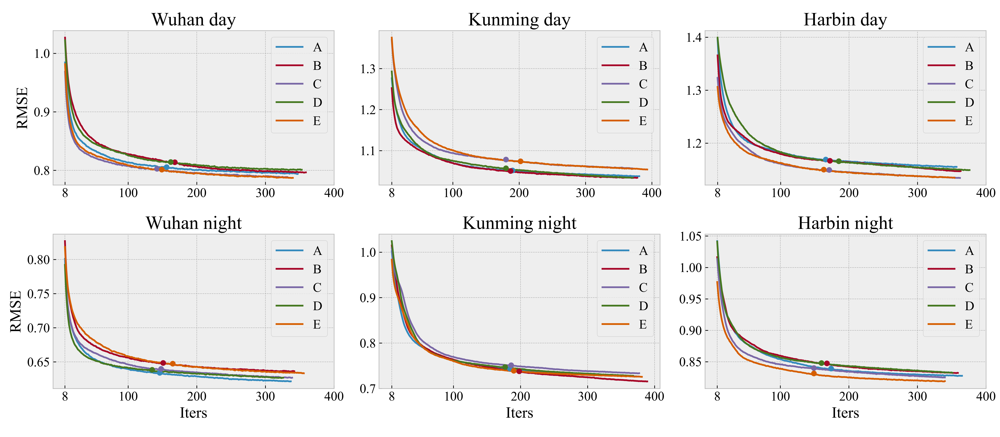

### Bayesian Temporal Tensor Factorization-Based Interpolation for Time Series Remote Sensing Data with Large-Area Missing Observations 

当前卫星遥感数据受云盖，云阴影等影响，导致大面积的观测缺失，严重影响后续的数据分析。在过去的研究中，学者们开发了各种有效的数据插补方法，但它们通常不能有效地插补大面积缺失的时序数据。为了解决上述问题，开发了一种稳健可靠的插补算法HTR-BTTF（Hilbert tensor rearrangement with bayesian temporal tensor factorization）。首先，在空间维度使用希尔伯特空间填充曲线分散大区域集中的缺失值，在时间维度，重新排列为年份×周期的二维形式，最终实现时空张量的重新排列。


为了完成高鲁棒性的插补任务，文中使用贝叶斯张量分解框架，通过引入时间向量自回归过程使得模型学习时序变化特征。为了提高贝叶斯张量分解的插补效率，我们提出使用Early Stopping机制提前终止Burn过程。



最后，我们针对重构好的模型提出重新堆叠（restack）概念，通过对希尔伯特填充曲线的均匀采样实现restack，通过该方法实现维度的修剪，该方法进一步提高了插补的效,在一定范围内控制RMSE增长，显著提高了模型的插补效率。
.jpg)

文中使用武汉市、哈尔滨市和昆明市的MOD11A2数据作为测试，截取150×150空间大小的尺寸，时序长度为138。通过实验证明，文中所提出方法相比其他时空插补模型具有非常友好的鲁棒性，同一套参数在最大缺失率的实验中均取得最好的结果，并且仅需12分钟左右即可完成插补工作。


#### 致谢

- Xinyu Chen团队提供的贝叶斯时间张量分解的Code[transdim：https://github.com/xinychen/transdim.git](https://github.com/xinychen/transdim.git)

#### Cite


```
@ARTICLE{9672202,
  author={He, Haixu and Yan, Jining and Wang, Lizhe and Liang, Dong and Peng, Jianyi and Li, Chengjun},
  journal={IEEE Transactions on Geoscience and Remote Sensing}, 
  title={Bayesian Temporal Tensor Factorization-Based Interpolation for Time Series Remote Sensing Data with Large-Area Missing Observations}, 
  year={2022},
  volume={},
  number={},
  pages={1-1},
  doi={10.1109/TGRS.2022.3140436}}
```


```
@ARTICLE{9380704,
  author={Chen, Xinyu and Sun, Lijun},
  journal={IEEE Transactions on Pattern Analysis and Machine Intelligence}, 
  title={Bayesian Temporal Factorization for Multidimensional Time Series Prediction}, 
  year={2021},
  volume={},
  number={},
  pages={1-1},
  doi={10.1109/TPAMI.2021.3066551}}
```

